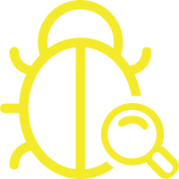
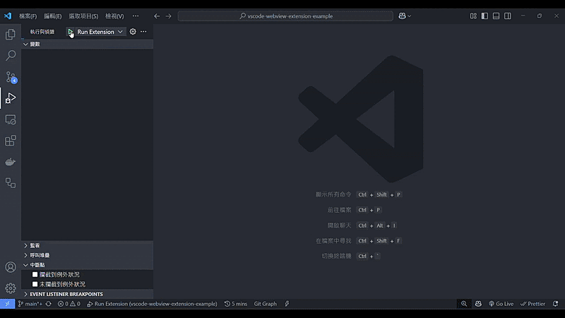

# 致謝

此 Repository 主要作為學習用途，將專案結構重命名為 view-vue => view-sidebar, view-react => view-panel，以符合 Webview 實際開發場景。

同時結合 Husky 與導入 Tailwind CSS 框架，以提升開發者體驗。

原作者地址：

<https://github.com/liutaigang/vscode-webview-extension-example>

## 簡介

Vscode extension 的 webview 開發模板，整合 Husky, Vue3 + vite, TailwindCSS 框架，開發 Webview view & Web Panel

## 專案結構

```tree
└── vscode-webview-extension-template/
    ├── husky/                     # git hook
    ├── packages/
    │   ├── extension/             # 插件後端
    │   │   ├── out/
    │   │   │   ├── view-sidebar/  # Sidebar view 打包靜態檔案
    │   │   │   ├── view-panel/    # Panel view 打包靜態檔案
    │   │   │   ├── extension/     # Extension 打包靜態檔案
    │   │   ├── src/
    │   │   ├── package.json       # 包含插件的 Command/Views 註冊資訊
    │   │   ├── tsconfig.json      # Typescript 環境設定
    │   │   └── rollup.config.mjs  # Rollup 打包設定
    │   ├── view-panel/            # Panel view 模組
    │   │   ├── public/
    │   │   ├── src/
    │   │   ├── index.html
    │   │   ├── package.json
    │   │   ├── tailwind.config.js # Tailwind 樣式設定
    │   │   ├── tsconfig.json      # Typescript 環境設定
    │   │   └── vite.config.js
    |   └── view-sidebar/          # Sidebar view 模組
    │       ├── public/
    │       ├── src/
    │       ├── index.html
    │       ├── package.json
    │       ├── tailwind.config.js # Tailwind 樣式設定
    │       ├── tsconfig.json      # Typescript 環境設定
    │       └── vite.config.js
    ├── pnpm-lock.yaml
    ├── pnpm-workspace.yaml    # pnpm workspace 設定
    └── package.json           # root package 指令/共用套件資訊
```

## Quick Start

Open this project on vscode, run:

if pnpm not installed:

```bash
npm i pnpm -g
```

if not installed packages:

```bash
pnpm install --frozen-lockfile
```

Development:

- Press F5 to open a new window with your extension loaded.
- After opening Debug window, click on the icon in the activity bar: 

## Demo


